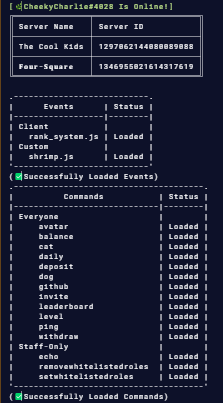

▬▬▬▬▬▬▬▬▬▬▬▬▬▬▬▬▬▬▬▬▬▬▬▬▬▬▬▬▬▬▬▬▬▬▬▬▬▬▬▬▬▬▬▬▬▬

# Four-Square Discord Bot

This is a discord bot that I've been working on in my free time as just a little hobby thing that I've been working on. This bot is a modular discord bot.
The purpose of making this discord bot open source is to show that there is no malicious code but also hope to inspire people to make there own discord bots.

# _Application Commands_

*Everyone:*

- `/avatar`
- `/balance`
- `/cat`
- `/dog`
- `/github`
- `/invite`
- `/leaderboard`
- `/ping`
- `/wihdraw`
- `/deposit`
- `/daily`
- `/level`

*Staff-Only:* ( `Requires Administrator Permissions` )

- `/echo`
- `/setwhitelistrole`
- `/removewhitelistrole`

if you need any help at all regarding the discord bot code please dm me on discord.   
`@evilsaint1022`

# _Four-Square Support Server_   
https://discord.com/invite/cVMh7SrvvF                             
‎ 
‎ 
- **This code is free to use.**

// Made by Evilsaint1022

▬▬▬▬▬▬▬▬▬▬▬▬▬▬▬▬▬▬▬▬▬▬▬▬▬▬▬▬▬▬▬▬▬▬▬▬▬▬▬▬▬▬▬▬▬▬